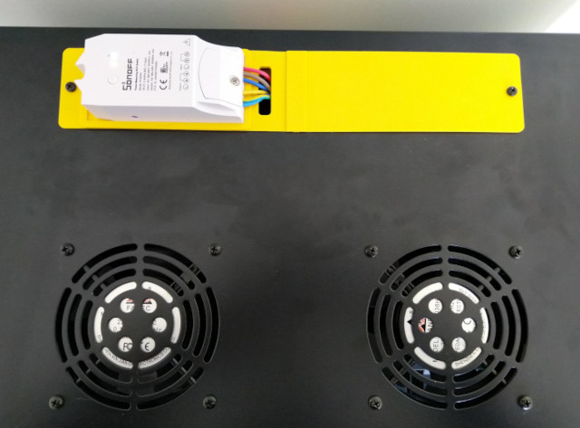
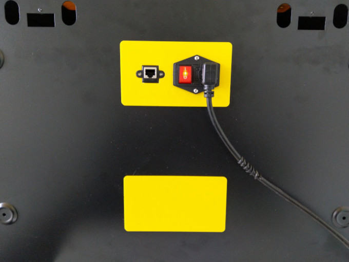

> [!WARNING]
> This series remained unfinished and I currently have no plans to continue it. Still, the published content may be useful.

This is the fourth part of a series of posts in which I explain how I built a Kubernetes cluster using Raspberry Pi. Here I will describe the mechanism I use to measure the cluster's electrical consumption.

| Part                                                           | Title                      |
|---------------------------------------------------------------|----------------------------|
| [P01]() | Hardware                   |
| [P02]()| Operating System and Docker|
| [P03]()| K3S Cluster                |
| **P04**                                                       | **Power Consumption**      |

## Introduction

In a previous post of this series, I already mentioned the first dilemma I faced: [cloud vs. on premise](/#introducción). At that time, I considered the costs of both alternatives, although the comparison was not very precise, since for the *on premise* option I didn't take into account the electrical cost of keeping the cluster running. That's why I have since looked for a way to measure the cluster's electrical consumption.

From the beginning, I was fully aware that the cluster project would take me several months, considering only the time spent on research, testing, and learning. If it evolves as I hope, the cluster will become a central piece and will be in continuous use. My intention is to use it to run some of the applications I regularly use and currently have scattered across several Raspberry Pis around the house, such as Home Assistant, which I mention in this post.

Considering that the cluster will be running continuously, I believe it is very interesting to measure its electrical consumption and calculate its cost. This way I can make a more accurate comparison between the cost of a cloud cluster and the cost of this cluster.

## How to Measure Power Consumption?

To measure the cluster's consumption, I chose a [Sonoff Pow R2](https://www.amazon.es/gp/product/B07C864DSZ/ref=ppx_yo_dt_b_asin_title_o05_s01). I have placed it *before* the power strip that supplies all the cluster's components. This way, all the current needed to run the cluster—lights, ventilation, Raspberry Pis, switch, etc.—passes through the Sonoff and can be measured globally.



To attach the Sonoff to the cluster case, I designed [some pieces](#piezas-para-la-caja-del-cluster) and printed them with my 3D printer. I decided to initially leave the Sonoff outside to get better WiFi coverage.

> Would the cluster case act as a [Faraday cage](https://en.wikipedia.org/wiki/Faraday_cage)?

In this case, I preferred to be cautious and leave it outside at first, even if it's less aesthetic. In the future I may redesign the pieces to place the Sonoff inside the cluster case.

Measuring consumption is useless if it is not logged. To record the consumption measured by the Sonoff, I used a [Home Assistant](https://www.home-assistant.io) instance I have running for home automation. This allows me to easily display the consumption on a dashboard. In this post I won't explain how to install Home Assistant, but I will describe some configurations I had to adjust.

## Sonoff Pow R2

This is an inexpensive device that can be defined as an “intelligent” switch that can be controlled via WiFi and that measures electrical consumption. In this case, I do not use it as a switch but only to measure consumption. The way to “disable” the switch (via software) is to configure it so that it is always *on*. A more invasive method would be to desolder the relay and bridge it.

Sonoff provides a mobile app through which you can control and configure their devices. For all of this to work, the data generated by the devices is sent to the company's servers and from there to the mobile devices.

However, I am not interested in my data passing through a third-party server, nor do I want another mobile app, because I want to integrate it with Home Assistant. The advantage of Home Assistant is that it allows me to integrate devices from different manufacturers, keep all home automation centralized, and use a single app to control everything. In this case, it also has the advantage that the data stays at home and does not leave my network.

## How to Integrate Sonoff with Home Assistant?

[ESPHome](https://esphome.io) is the answer!

*ESPHome* is a system that allows remote control of *ESP8266* and *ESP32* devices. And, conveniently, Sonoff devices use an ESP8266 chip. This is not a coincidence; I researched this before deciding to buy the Sonoff Pow R2. When I discovered ESPHome and how easy it was to integrate with Home Assistant, the decision was clear.

Integrating ESPHome with Home Assistant is very easy and consists of [installing an add-on in Home Assistant](https://esphome.io/guides/getting_started_hassio.html). Installation is simple, but I experienced issues accessing the interface through NGINX due to the WebSockets used by the ESPHome add-on. To solve it, I added the [following configuration to NGINX](#configuración-nginx-para-websockets-de-esphome).

## Programming the Sonoff

To control an ESP8266-based device with ESPHome, you need to flash the ESPHome firmware binary onto the chip. To flash this binary, I used [esphome-flasher](https://github.com/esphome/esphome-flasher/releases). A *USB-to-TTL serial adapter* is required to connect the device to a PC. I used a [CH340G adapter](https://www.amazon.es/gp/product/B07HM7RPB7/ref=ppx_yo_dt_b_asin_title_o05_s01). The drivers for the adapters are available [here](#drivers-adaptador-usb-a-ttl).

### How do we obtain the firmware binary?

This is very easy thanks to ESPHome, which simplifies the entire process. You just need to create a YAML file describing the configuration and behavior you want. ESPHome automatically generates the firmware binary from that YAML file.

This is the YAML file I used:

```yaml
esphome:
  name: rpicluster_power
  platform: ESP8266
  board: esp01_1m

# WiFi connection
wifi:
  ssid: !secret wifi_ssid
  password: !secret wifi_password

  # Enable fallback hotspot (captive portal) in case wifi connection fails
  ap:
    ssid: "Rpicluster Sonoff POW R2"
    password: "rpiclustersonoffpowr2"

# Enable logging
logger:
  baud_rate: 0

# Enable Home Assistant API
api:

# Enable over-the-air updates
ota:

# Enable Web server
web_server:
  port: 80

uart:
  rx_pin: RX
  baud_rate: 4800

sensor:
  - platform: wifi_signal
    name: "RPI Cluster WiFi Signal"
    update_interval: 15s
    icon: mdi:wifi
  - platform: uptime
    name: "RPI Cluster Uptime"
  # Power sensor
  - platform: cse7766
    update_interval: 5s
    # Current sensor
    current:
      name: "RPI Cluster Current"
      icon: mdi:current-ac
      unit_of_measurement: A
      accuracy_decimals: 3
    # Voltage sensor
    voltage:
      name: "RPI Cluster Voltage"
      icon: mdi:flash
      unit_of_measurement: V
      accuracy_decimals: 1
    # Power sensor
    power:
      name: "RPI Cluster Power"
      icon: mdi:gauge
      unit_of_measurement: W
      accuracy_decimals: 0
      id: rpiclusterpower

  - platform: total_daily_energy
    name: "RPI Cluster Daily Energy"
    power_id: rpiclusterpower
    filters:
      - multiply: 0.001
    unit_of_measurement: kWh
    icon: mdi:chart-bar

time:
  - platform: homeassistant
    id: homeassistant_time

interval:
  - interval: 10s
    then:
      if:
        condition:
          wifi.connected:
        then:
          - light.turn_on: led
        else:
          - light.turn_off: led

binary_sensor:
  # Binary sensor for the button press
  - platform: gpio
    name: "RPI Cluster Power Button"
    pin:
      number: GPIO0
      mode: INPUT_PULLUP
      inverted: true
    on_press:
      - switch.toggle: relay
  
  - platform: status
    name: "RPI Cluster Status"

switch:
  - platform: gpio
    name: "RPI Cluster Sonoff Relay"
    id: relay
    pin: GPIO12
    restore_mode: RESTORE_DEFAULT_ON

  - platform: restart
    name: "RPI Cluster Sonoff Restart"

output:
  - platform: esp8266_pwm
    id: pow_blue_led
    pin:
      number: GPIO13
      inverted: True

light:
  - platform: monochromatic
    name: "RPI Cluster POW Blue LED"
    output: pow_blue_led
    id: led

text_sensor:
  - platform: version
    name: "RPI Cluster POW Version"
```

The pinout information for the Sonoff is available in the [documentation](https://esphome.io/devices/sonoff.html#sonoff-pow-r2).

I want to highlight that the Sonoff only needs to be connected to the PC for the initial flashing. In the YAML above, the `OTA` (over-the-air) feature is enabled, allowing firmware updates via WiFi without reopening the device.

## Control Panel

Thanks to the ESPHome integration with Home Assistant, it is very easy to create a dashboard like the following:


This dashboard includes:

- Current consumption
    - Current
    - Power
    - Voltage
- Status
    - Uptime ([see template in annex](#template-para-el-tiempo-encencido))
    - ESPHome version on the Sonoff
- Consumption history
- Daily consumption
- Blue LED status and control
    - I use this LED to display WiFi connectivity (on = connected)
- Relay status and control

> The consumption spike above 1500W does not correspond to normal cluster use. It was caused by tests I performed to calibrate the Sonoff. Sonoff calibration is outside the scope of this post and I'll explain it in the future.

## Conclusion

The main objective of building this cluster was educational. Today, I'm not sure if this will be its only purpose or whether, once finished, I will use it for other things—ideas are not lacking. Knowing its electrical consumption and resulting economic cost is an important variable I will consider when deciding how to use the cluster in the medium to long term.

## Annex

### NGINX Configuration for ESPHome WebSockets

```
location /api/hassio_ingress {
    resolver 127.0.0.11 valid=30s;
    # Home Assistant IP
    set $upstream_app 192.168.86.4;
    # Home Assistant Internal Port
    set $upstream_port 8123;
    # Home Assistant Internal Protocol
    set $upstream_proto http;
    proxy_pass $upstream_proto://$upstream_app:$upstream_port;

    # Home Assistant External Host:Port
    proxy_set_header Host $host:9443;

    proxy_http_version 1.1;
    proxy_set_header Upgrade $http_upgrade;
    proxy_set_header Connection "upgrade";
}
```

### USB-to-TTL Adapter Drivers

- [CH340G](resources/ttl_drivers/CH340G.rar)
- [CP210X](resources/ttl_drivers/CP210x_Universal_Windows_Driver.zip)
- [PL2303](resources/ttl_drivers/PL2303_Prolific_DriverInstaller_v1_8_0.zip)

### Template for Uptime

By default, the Sonoff sends the uptime in seconds. Since this device is designed to stay on continuously sending readings—regardless of whether the cluster is on or not—displaying raw seconds is not very meaningful. To convert it into a more useful value, I created the following template in Home Assistant:

```yaml
sensor:
  - platform: template
    sensors:
      rpi_cluster_pow_uptime_readable:
        friendly_name: "RPI Cluster Uptime"
        icon_template: "mdi:timer"
        value_template: >-
          
          
          
            {{ days }} days, {{ (uptime - (days * 86400)) | int | timestamp_custom('%H:%M:%S', false) }}
          
            {{ uptime | int | timestamp_custom('%H:%M:%S', false) }}
          
```

If it has been on for more than a day, it will display the number of days plus hours, minutes, and seconds. Otherwise, only hours, minutes, and seconds will be shown.

> This template could be further improved by including months and years.

### Parts for the Cluster Case

To design all the pieces, I used [OnShape](https://www.onshape.com). All my designs for the cluster case are public and available [here](https://cad.onshape.com/documents?nodeId=4157ec7e4f12d21ec2893ac1&resourceType=folder).

As you can see in the following images, the pieces for holding the Sonoff are not the only ones I designed. I also designed a cover for one of the rear openings and another cover to hold both the [power socket](https://www.amazon.es/gp/product/B07RRY5MYZ/ref=ppx_yo_dt_b_asin_title_o06_s00) and the [network socket](https://www.amazon.es/gp/product/B01MD2AYSW/ref=ppx_yo_dt_b_asin_title_o04_s00) for the entire cluster:




I am very happy with the final result; everything is neatly organized with minimal cabling:

