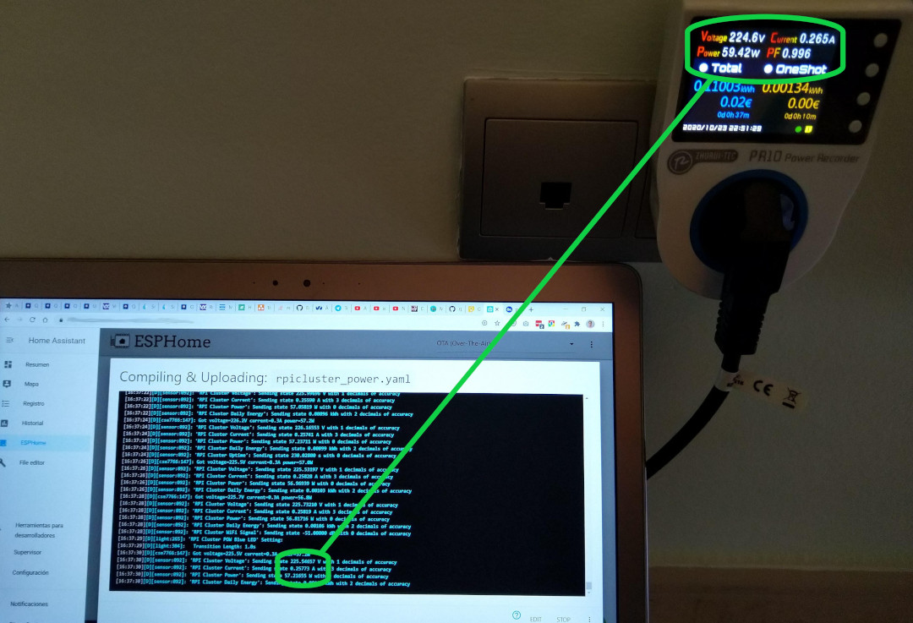

In [another post](#how-to-measure-power-consumption) I already explained how I measured the consumption of a Raspberry Pi cluster using a Sonoff Pow R2. It is important to calibrate this device before using it so that its measurements are as accurate as possible.

In this post I will explain how to calibrate it. To do so, you will need a power meter. I used a [ZHURUI PR10-C EU16A](https://www.amazon.es/gp/product/B06VWMS7QS/ref=ppx_yo_dt_b_asin_title_o03_s00), which is not very expensive and works quite well. This device allows you to view voltage, current, and power consumption at the same time. This last feature may seem minor, but later on you will see how it greatly simplifies the calibration process.

To perform the calibration, connect the Zhurui to a power outlet and the Sonoff to the Zhurui. The process consists of connecting various devices with different power consumption levels to the Sonoff and noting both the Zhurui readings and the Sonoff readings.

In my case I used the following devices:

- A desk lamp with a halogen bulb (11W)
- A desk lamp with an incandescent bulb (60W)
- A vacuum cleaner (up to 800W)
- An iron (2000W)

I connected each device one by one to the Sonoff, which in turn was connected to the consumption meter, and recorded the measurements from both devices. To take the Sonoff readings, I used a laptop to access the ESPHome console. I placed this laptop next to the power outlet where the Zhurui was connected so that a single photograph would capture both sets of readings.

This is where it becomes very convenient that the meter displays all interesting values at the same time, since a single snapshot provides all the necessary information. Here you can see an example of the readings obtained when connecting the incandescent bulb:



Once a reading has been taken for each device, you have all the necessary data to calibrate the Sonoff. Due to how ESPHome is designed, this step is very simple. You just need to configure some filters where you write down the measurement from the external meter along with the Sonoff's measurement.

Where previously you had something like this:

```yaml
# Current sensor
current:
  name: "RPI Cluster Current"
  icon: mdi:current-ac
  unit_of_measurement: A
  accuracy_decimals: 3
```

You will now have something like this:

```yaml
# Current sensor
current:
  name: "RPI Cluster Current"
  icon: mdi:current-ac
  unit_of_measurement: A
  accuracy_decimals: 3
  filters:
    # Map from sensor -> measured value
    - calibrate_linear:
        - 0.0 -> 0.010
        - 0.15855 -> 0.153
        - 0.25773 -> 0.265
        - 2.45250 -> 2.519
        - 3.02082 -> 3.066
        - 3.41044 -> 3.464
        - 8.73604 -> 8.837
    # Make everything below 0.01A appear as just 0A.
    # Furthermore it corrects 0.01A for the power usage of the sonoff plus the led of the multi-socket.
    - lambda: if (x < (0.01 - 0.01)) return 0; else return (x - 0.01);
```

> In [this post](#how-do-we-obtain-the-firmware-binary) you can see the complete Sonoff code

And something similar for the power sensor:

```yaml
# Power sensor
power:
  name: "RPI Cluster Power"
  icon: mdi:gauge
  unit_of_measurement: W
  accuracy_decimals: 0
  id: rpiclusterpower
  filters:
    # Map from sensor -> measured value
    - calibrate_linear:
        - 0.0 -> 1.19
        - 15.33994 -> 16.98
        - 57.21655 -> 59.42
        - 261.44540 -> 272.0
        - 459.74557 -> 471.6
        - 741.94073 -> 761.0
        - 1905.09253 -> 1957.0
    # Make everything below 2W appear as just 0W.
    # Furthermore it corrects 1.19W for the power usage of the sonoff plus the led of the multi-socket.
    - lambda: if (x < (2 + 1.19)) return 0; else return (x - 1.19);
```

And for the voltage sensor:

```yaml
# Voltage sensor
voltage:
  name: "RPI Cluster Voltage"
  icon: mdi:flash
  unit_of_measurement: V
  accuracy_decimals: 1
  filters:
    # Map from sensor -> measured value
    - calibrate_linear:
        - 0.0 -> 0.0
        - 226.84409 -> 225.6
        - 225.37788 -> 224.9
        - 225.54657 -> 224.6
        - 224.83321 -> 224.5
        - 224.59578 -> 224.0
        - 224.23352 -> 223.9
```

ESPHome performs a linear regression based on the above values (using a least-squares fitting function) to “correct” the measurements taken by the Sonoff.

> I haven't mentioned it until now, but you should also take a reading with no device connected to the Sonoff.

## Conclusion

As you can see, calibrating a Sonoff device is very simple. The more accurate the external power meter used, the better the Sonoff calibration will be. It is important to use devices with different power consumption levels that cover the entire range so that the calibration is as accurate as possible. If you buy multiple Sonoff units, each one should be calibrated individually.