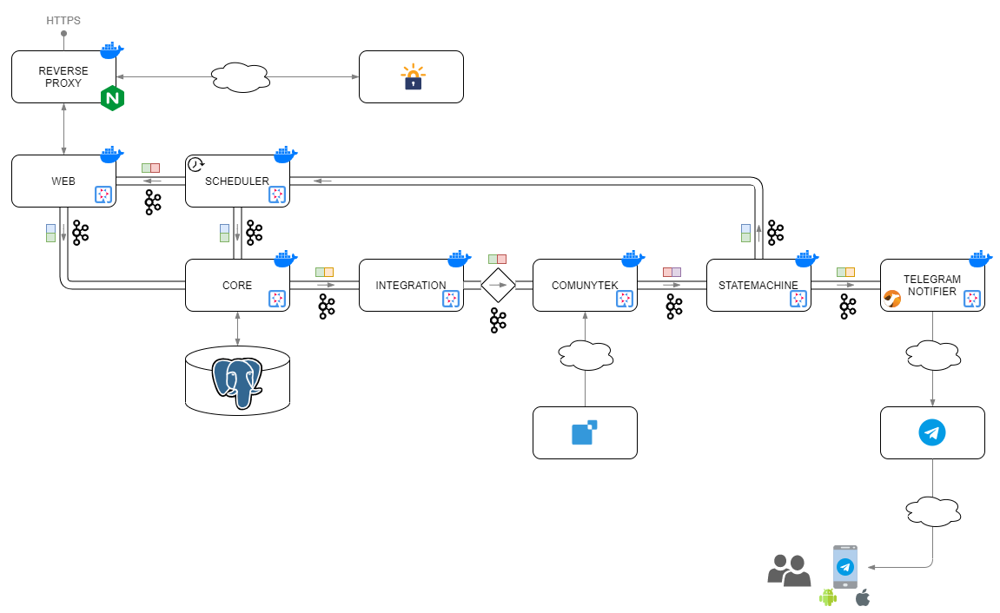

## Contexto

En el año 2019 hubo un cambio de ley que obliga a todas las empresas de España a proporcionar información sobre la jornada laboral de sus trabajadores, lo que comunmente conocemos como _fichajes_.

Mi empresa se ha adaptado al cambio de legislación añadiendo una nueva sección en la intranet para que cada empleado pueda registrar la jornada laboral. El enfoque que ha seguido mi empresa es el fichaje "en tiempo real", es decir, se toma el momento en el que se están registrando las acciones como el momento en el que las realizas. Esto obliga a fichar en el momento real en el que empiezas a trabajar, en el que comienzas a comer, en el que terminas de comer... No existe ninguna posibilidad de corrección por parte de los trabajadores, si se olvida registrar alguna de las acciones hay que escribir un email al responsable para indicarlo.

Este enfoque de "tiempo real" no es el único posible, he visto otras empresas que también proporcionan un apartado en su intranet, pero que permiten hacer el fichaje "en diferido".

Cuestiones a parte serían si estas implementaciones cumplen con la ley o qué responsabilidades tiene el trabajador o qué pasaría si se hace una inspección y los fichajes del trabajador no son correctos.

## Problema

La solución tomada por mi empresa no es una solución pensada para el trabajador que sea cómoda de usar, todo lo contrario:

- El trabajador tiene que recordar todas las acciones que tiene que realizar
- Para ciertas acciones el trabajador tiene no sólo que realizar la acción, sino que tiene que escribir un texto válido para dicha acción
- Para realizar cada una de las acciones el trabajador tiene que acceder a la intranet, teniendo que introducir sus credenciales
- Algunas de las acciones se realizan desde sitios donde no hay un ordenador, por lo que hay que acceder a la intranet desde el móvil cuando la intranet no está adaptada para ello. Los menús son muy pequeños y es difícil llegar a la zona de fichajes

## Objetivo

Me he propuesto simplificar todo este proceso de tal forma que los fichajes se realicen de una manera sencilla, y lo más fieles posible a la realidad. Además utilizaré tecnologías que me permitan seguir desarrollándome como profesional de la Informática.

## Requisitos

Estos son los requisitos funcionales que guiarán el planteamiento y desarrollo de la solución:

- Fichaje lo más fiel posible a la realidad
- Las acciones manuales por parte del usuario serán muy sencillas
- Se tendrán en cuenta los fichajes realizados directamente en la intranet

## Solución

La solución desarrollada es un chatbot de telegram: [TimeHammerBot](https://t.me/TimeHammerBot). Lo único necesario para podeer utilizarla será disponer de un smartphone y tener instalada la aplicación de mensajería *Telegram*.

Se ha desarrollado una solución inicial específica para mi empresa, pero está preparada para ser fácilmente extensible a cualquier otra empresa (S**O**LID 😉).

## Funcionamiento

El trabajador se registrará en el chatbot [TimeHammerBot](https://t.me/TimeHammerBot) de *Telegram*. Para ello tendrá que indicar la empresa en la que trabaja, los credenciales para acceder a la intranet donde se realiza el fichaje manual y los horarios habituales: hora de comienzo y fin de la jornada laboral y hora de comienzo y fin de la comida (para cada día de la semana). Una vez realizado el registro podrá olvidarse de volver a acceder a la intranet para realizar un fichaje. A partir de ese momento será el chatbot quien le recuerde a las horas configuradas, la realización de las acciones pertinentes. Además junto con cada recordatorio, se proporcionarán una serie de botones que permitirán confirmar la realización de dichas acciones.

Por ejemplo, si el trabajador ha indicado que los lunes suele comenzar la jornada laboral a las 8:00, a esa hora recibirá un mensaje en *Telegram* preguntándole si ya ha comenzado a trabajar. Debajo del mensaje aparecerán una serie de botones: "Sí", "+5m", "+10m", "+15m", "+20m", "No". Al pulsar el botón "Sí", el chatbot se encargará de registrar el inicio de la jornada en la intranet. Al pulsar los botones "+Xm", se le pedirá al chatbot que se espere X minutos antes de volver a preguntar. Al pulsar el botón "No", se le indicará al chatbot que ese día no se trabaja y hasta el día siguiente no volverá a preguntar nada.

El chatbot recuperará de la intranet las vacaciones del trabajador con el objetivo de no molestar durante ese periodo de tiempo. También tendrá en cuenta los días festivos de la ciudad de trabajo del trabajador (motivo por el cual durante el registro hay que indicar la ciudad de trabajo).

El chatbot es un mero intermediario, no guardará en ningún momento los fichajes del trabajador. Para conocer el estado de un trabajador lo recuperará de la intranet de la empresa del trabajador. De esta forma se puede combinar el uso del chatbot junto con la realización de ciertas acciones de forma manual. Por ejemplo, si el trabajador ha indicado que los viernes suele comenzar a trabajar a las 8:00, pero excepcionalmente, un viernes comienza su jornada a las 7:30, podrá acceder a la intranet y registrar su fichaje a las 7:30. Cuando sean las 8:00 el chatbot tendrá en cuenta las posibles acciones realizadas manualmente en la intranet antes de preguntar nada. Por lo que en este caso, a las 8:00 el chatbot no preguntará nada al trabajador.

Con este modelo de funcionamiento se cumplen los 3 requisitos planteados para el proyecto:

- Todos los fichajes requerirán de una confirmación por parte del usuario y serán fieles a la realidad.
- El usuario se olvida de tener que conectarse a una intranet y registrar una serie de acciones y en su lugar lo único que tiene que hacer es pulsar un botón cuando le llega un mensaje al *Telegram*.
- Al no guardar el estado de los trabajadores y recuperarlo siempre de la intranet, se posibilita combinar el uso de ambos sistemas.

## Arquitecura

A continuación un par de diagramas para ver los módulos que existen y cómo interaccionan entre sí:

En la siguiente tabla se puede ver el propósito de cada módulo:

| Módulo                  | Propósito                                                                                                                                                                                                                                                                                                                                                                                                                                                                                                                                                                              |
|-------------------------|----------------------------------------------------------------------------------------------------------------------------------------------------------------------------------------------------------------------------------------------------------------------------------------------------------------------------------------------------------------------------------------------------------------------------------------------------------------------------------------------------------------------------------------------------------------------------------------|
| reverse proxy           | Proxy inverso para gestionar certificados ssl a través de let's encrypt                                                                                                                                                                                                                                                                                                                                                                                                                                                                                                                |
| web                     | Web para: <ul><li>Registro de usuarios (obtener compañía, lugar de trabajo, horarios habituales de trabajo y comida</li><li>Refresco y solicitud de credenciales</li><ul><li> La interacción principal de los usuarios es con la aplicación de Telegra, sin embargo, los credenciales no se solicitan a través de ese canal, para eso se utiliza la web (con comunicación cifrada)</li></ul><li>Hacer demos</li></ul>                                                                                                                       |
| scheduler               | Desencadena acciones periódicamente, las principales son: <ul><li>Actualizar el estado de los trabajadores</li><ul><li> Para hacer el sistema compatible con el uso de la aplicación de fichajes de la empresa para casos excepcionales</li></ul><li>Actualizar las vacaciones de los trabajadores</li><ul><li> Para no molestar innecesariamente a los trabajadores durante sus vacaciones</li></ul><li>Limpieza de las vacaciones pasadas</li></ul>                                            |
| core                    | Conectado con la base de datos y responsable de todas las tareas de persistencia: <ul><li>Registro de trabajadores</li><li>Actualización de preferencias de los trabajadores</li><li>Obtener el listado de trabajadores que trabajan en un instante concreto</li><li>etc.</li></ul>                                                                                                                                                                                                                                                                                                    |
| integration             | Enruta los mensajes al módulo específico para la compañía del trabajador     Cuando desarrollé esta solución no tenía experiencia previa con arquitecturas EDA, ahora sé que este módulo noñ tiene sentido ya que los brokes de mensajería tienen capacidad de enrutar mensajes en base a contenido del mensaje                                                                                                                                                                                                                     |
| communytek              | Interfaz de comunicación con con la empresa Comunytek para registrar las acciones de los trabajadores (inicio de la jornada, inicio de la comida, fin de la comida, fin de la jornada, obtención de vacaciones, etc.)     Cada compañía soportada tendría su propio módulo                                                                                                                                                                                                                                                          |
| statemachine            | Sus principales cometidos son: <ul><li>Determinar el estado de un trabajador en base a un diagrama de estados</li><li>Lleva la cuenta de las esperas de los trabajadores</li><li>En base al estado del trabajador y a las esperas decide la siguiente acción a realizar</li></ul>                                                                                                                                                                                                                                                                                                      |
| telegramchatbotnotifier | Envía mensajes a los trabajadores a través de Telegram                                                                                                                                                                                                                                                                                                                                                                                                                                                                                                                                 |
| telegramchatbot         | Recibe los mensajes (tanto mensajes proactivos como respuestas a preguntas) de los trabajadores enviados a través de Telegram y los introduce en el sistema                                                                                                                                                                                                                                                                                                                                                                                                                            |
| commandprocessor        | Procesa los comandos de Telegram de los trabajadores     Telegram permite trabajar con un conjunto de comandos que evita tener que procesar mensajes de texto libre. Esto simplifica la comunicación, ya que los mensajes de texto libre podrían estar incompletos y requerirían varias idas y venidas en la comunicación con el trabajador hasta obtener la información requerida. Telegram permite definir un conjunto de comandos para un bot y proporciona botones especiales en el teclado para acceder a ellos de forma fácil |

Aquí algunos otros módulos que no aparecen en el diagrama:

| Módulo   | Propósito                                                                                                     |
|----------|---------------------------------------------------------------------------------------------------------------|
| common   | Utilidades compartidas, conversores, serializadores, DTOs entre diferentes módulos, etc.                      |
| catalog  | Gestiona los catálogos: `cities` y `companies`                                                                |
| monolith | Initialmente el sistema se desarrolló como un monolito, posteriormente se refactorizó en una arquitectura EDA |

Para conocer más detalles sobre el proyecto puedes acceder [aquí]()

## Conclusión

Este proyecto ha supuesto un reto bastante interesante por diversos motivos:

**- Llevar un proyecto adelante de principio a fin**

> El camino que hay que seguir desde que se tiene una idea hasta que esta se materializa siempre es complicado. A lo largo de este camino existen diversos momentos, en los que lo más fácil es no complicarse y ceder en el intento. Llegar a desplegar en producción una primera versión estable y funcional es motivo suficiente para sentirse orgulloso.

**- Afrontar un nuevo paradigma de programación**

> Cambiar la manera de pensar no es trivial. Tareas que considerabas sencillas, de repente, se convierten en complicados rompecabezas. Ante la más mínima complicación es tentador volver a las *antiguas costumbres* para salir del paso y seguir avanzando. Ha resultado agotador ser *fiel* a programación reactiva.

**- Nuevas tecnologías**

> En este proyecto he utilizado muchas tecnologías desconocidas para mi: Quarkus, Kafka, EDA, compilación nativa de java, imágenes distroless. Para mi siempre es motivador enfrentarme a un nuevo framework, lenguaje, herramienta... me recuerda a cuando era niño y me regalaban un juguete. Lo que resulta un verdadero reto es realizar un proyecto en el que la gran mayorías de las tecnologías son desconocidas y pasas más tiempo en las páginas de documentación que programando.

**- Ponerse un objetivo y ceñirse a él**

> Cuando no tienes a un jefe que te va guiando hacia una meta es complicado no desviarse del camino y resulta muy sencillo irse por las ramas. Más aún cuando tienes un montón de *"juguetitos"* nuevos que probar e investigar. Este proyecto no ha sido una excepción, de hecho, la solución final es la tercera que se ha desarrollado desde cero. El proyecto comenzó siendo serverless, basándose en el uso de Firebase. Después se descartó la idea de serverless y pasó a ser un monolito desarrollado en Quarkus. Finalmente se ha mantenido el uso de Quarkus, pero se ha modularizado implementando una arquitectura orientada a eventos.

Se trata de una primera versión funcional con mucho margen de mejora. He incorporado una gran cantidad de novedades tecnológicas, dada mi experiencia, y hasta el momento no he podido profundizar mucho en ellas para poder tener esta primera versión funcional lo antes posible.