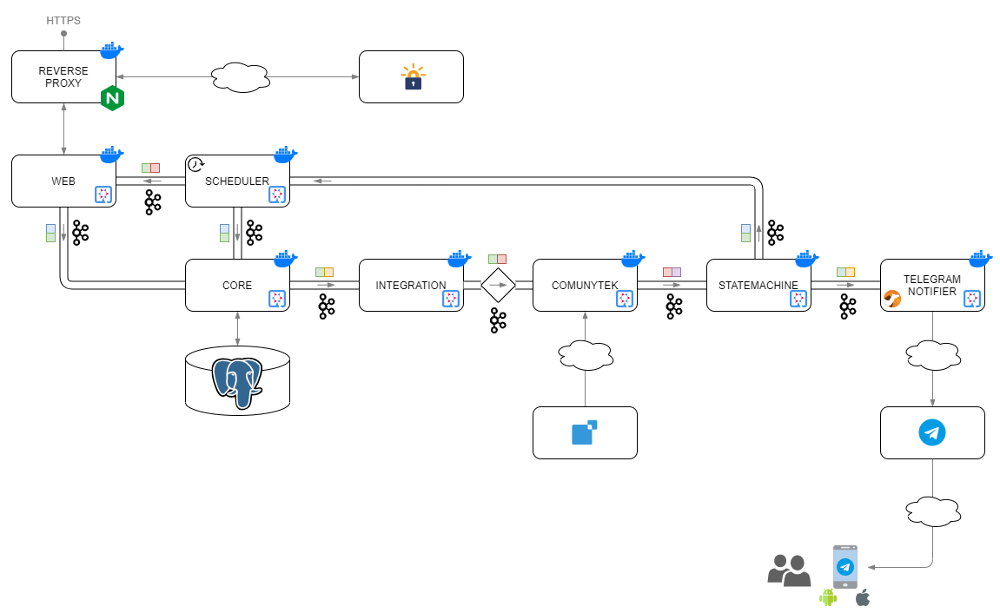
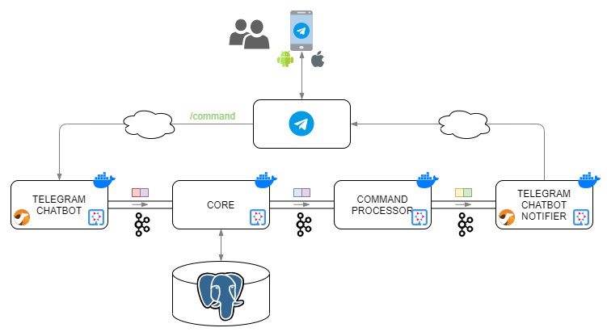
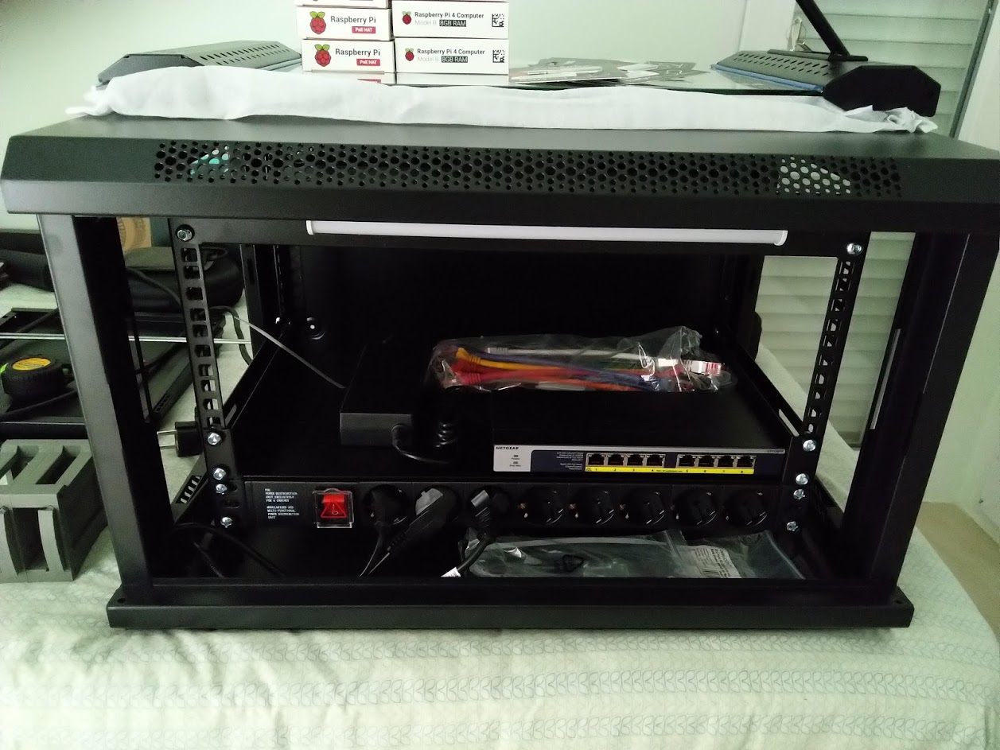
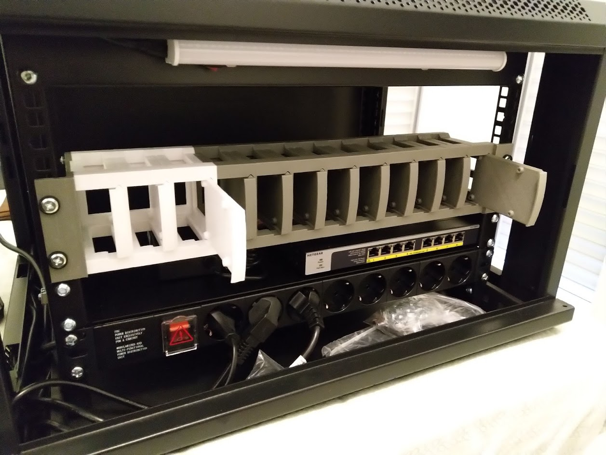

### Sistema de automatización de fichajes

---

## Objetivo

El principal objetivo es **simplificar el proceso de fichajes** de una empresa

<small>Un objetivo secundario es el de utilizar tecnologías para **seguir creciendo como profesional de la Informática**.</small>

---

<section data-markdown>
  
</section>

---

<section data-markdown>
  
</section>

---

## Solución

La solución desarrollada es un **chatbot de telegram**:

**TimeHammerBot**

https://t.me/TimeHammerBot

<small>Lo único necesario para poder utilizarla será disponer de un smartphone y tener instalada la aplicación de mensajería *Telegram*. También compatible con la versión web de *Telegram*</small>

---

<section data-markdown>
  
</section>

---

<section data-markdown>
  
</section>

---

<section data-markdown>
  
</section>

---

<section data-markdown>
  
</section>

---

## Extra I

El chatbot busca **molestar lo menos posible**

- Fines de semana
- Festivos
  - Ciudad de trabajo
- Vacaciones

---

## Extra II

**No se persiste la contraseña** de los usuarios, se guardan en memoria.

<small>Si se reinicia el contenedor que tiene en memoria las contraseñas, se enviará un mensaje a los trabajadores para que vuelvan a introducir su contraseña.</small>

---

# DEMO

---

<section data-markdown>
  
</section>

---

## Stack tecnológico

<ul>
<li>Java</li>
<li>Quarkus</li>
<li>Docker</li>
<li>Telegram Bots</li>
<li>Kafka</li>
<li>PostgreSQL</li>
</ul>

---

## Event Driven Architecture I

---

## Event Driven Architecture II

---

## Roadmap I

#### Reducción de llamadas a Comunytek

En la versión actual se realizan:

<small>30 * 12 + 6 * 12 + 4 = 436 llamadas/usuario/día</small>

Con la versión mejorada se realizarían:

<small>3 llamadas/acción * 4 acciones/día/usuario = 12 llamadas/usuario/día</small>

---

## Roadmap II

#### Kubernetes I

---

## Roadmap II

#### Kubernetes II

---

## Roadmap II

#### Kubernetes III

---

## Roadmap III

- Anular el registro
- Modificar la configuración
- Mejorar validaciones en el registro
- Añadir tests
- Tunear configuración Kafka
- Añadir monitorización de módulos
- NLP
- Modulo de administración

---

<section data-markdown>
  
</section>

---

<section data-markdown>
  
</section>

---

## Caso de Uso

Nuevo canal de comunicación para la realización de guardias