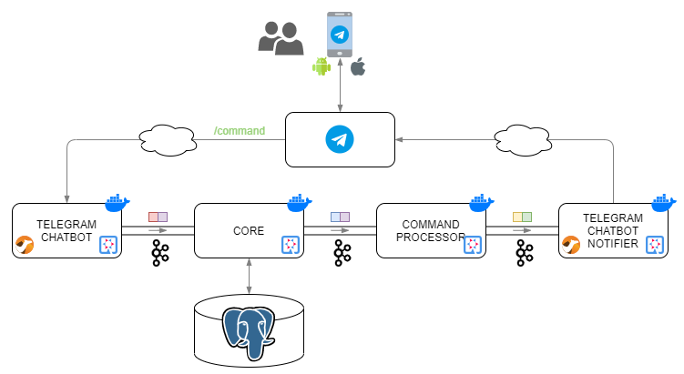

## Contexte

En 2019, un changement de loi a obligé toutes les entreprises en Espagne à fournir des informations sur le temps de travail de leurs employés, ce que l'on appelle communément le _pointage_.

Mon entreprise s'est adaptée à ce changement législatif en ajoutant une nouvelle section à l'intranet afin que chaque employé puisse enregistrer sa journée de travail. L'approche adoptée par mon entreprise est le pointage "en temps réel", c'est-à-dire que le moment où les actions sont enregistrées est considéré comme le moment où elles sont réellement effectuées. Cela oblige à pointer exactement au moment où l'on commence à travailler, où l'on commence la pause déjeuner, où l'on termine la pause déjeuner, etc. Aucune correction n'est possible de la part des employés : si une action est oubliée, il faut envoyer un e-mail au responsable pour le signaler.

Cette approche "en temps réel" n'est pas la seule possible. J'ai vu d'autres entreprises qui proposent également une section dans leur intranet, mais qui permettent de pointer "a posteriori".

D'autres questions seraient de savoir si ces implémentations respectent la loi, quelles sont les responsabilités de l'employé ou ce qui se passerait en cas d'inspection si les pointages de l'employé ne sont pas corrects.

## Problème

La solution adoptée par mon entreprise n'est pas pensée pour être confortable ou simple d'utilisation pour les employés, bien au contraire :

- L'employé doit se souvenir de toutes les actions à effectuer
- Pour certaines actions, l'employé ne doit pas seulement effectuer l'action, mais aussi saisir un texte valide pour celle-ci
- Pour effectuer chaque action, l'employé doit accéder à l'intranet et saisir ses identifiants
- Certaines actions sont réalisées dans des endroits où il n'y a pas d'ordinateur ; il faut donc accéder à l'intranet depuis un téléphone mobile alors que l'intranet n'est pas adapté à cet usage. Les menus sont très petits et il est difficile d'atteindre la zone de pointage

## Objectif

Je me suis fixé pour objectif de simplifier l'ensemble de ce processus afin que le pointage soit réalisé de manière simple et aussi fidèle que possible à la réalité. De plus, je souhaitais utiliser des technologies me permettant de continuer à évoluer professionnellement en tant qu'ingénieur informatique.

## Exigences

Voici les exigences fonctionnelles qui ont guidé la conception et le développement de la solution :

- Un pointage le plus fidèle possible à la réalité
- Les actions manuelles demandées à l'utilisateur doivent être très simples
- Les pointages réalisés directement dans l'intranet doivent être pris en compte

## Solution

La solution développée est un chatbot Telegram : [TimeHammerBot](https://t.me/TimeHammerBot). La seule chose nécessaire pour l'utiliser est de disposer d'un smartphone et d'avoir installé l'application de messagerie *Telegram*.

Une solution initiale spécifique à mon entreprise a été développée, mais elle est conçue pour être facilement extensible à n'importe quelle autre entreprise (S**O**LID 😉).

## Fonctionnement

L'employé s'inscrit sur le chatbot *Telegram* [TimeHammerBot](https://t.me/TimeHammerBot). Lors de l'inscription, il doit indiquer l'entreprise pour laquelle il travaille, les identifiants permettant d'accéder à l'intranet où le pointage manuel est effectué, ainsi que ses horaires habituels : heure de début et de fin de la journée de travail, et heure de début et de fin de la pause déjeuner (pour chaque jour de la semaine). Une fois l'inscription effectuée, il peut oublier l'accès à l'intranet pour pointer. À partir de ce moment-là, le chatbot lui rappellera, aux heures configurées, la réalisation des actions correspondantes. En plus de chaque rappel, une série de boutons est fournie pour confirmer l'exécution de ces actions.

Par exemple, si l'employé a indiqué que le lundi il commence habituellement sa journée de travail à 8 h 00, il recevra à cette heure-là un message sur *Telegram* lui demandant s'il a déjà commencé à travailler. Sous le message apparaîtra une série de boutons : "Oui", "+5m", "+10m", "+15m", "+20m", "Non". En appuyant sur le bouton "Oui", le chatbot se chargera d'enregistrer le début de la journée de travail dans l'intranet. En appuyant sur les boutons "+Xm", le chatbot attendra X minutes avant de reposer la question. En appuyant sur le bouton "Non", le chatbot sera informé que l'employé ne travaille pas ce jour-là et ne posera plus aucune question jusqu'au lendemain.

Le chatbot récupère les périodes de vacances de l'employé depuis l'intranet afin de ne pas le déranger pendant cette période. Il tient également compte des jours fériés de la ville dans laquelle travaille l'employé (c'est la raison pour laquelle la ville de travail doit être indiquée lors de l'inscription).

Le chatbot n'est qu'un simple intermédiaire ; il ne stocke à aucun moment les pointages de l'employé. Pour connaître l'état d'un employé, il récupère toujours les informations depuis l'intranet de l'entreprise. Cela permet de combiner l'utilisation du chatbot avec la réalisation de certaines actions de manière manuelle. Par exemple, si un employé a indiqué que le vendredi il commence habituellement à travailler à 8 h 00, mais qu'exceptionnellement il commence à 7 h 30 un vendredi donné, il pourra accéder à l'intranet et enregistrer son pointage à 7 h 30. Lorsque 8 h 00 arrivera, le chatbot tiendra compte des actions éventuellement réalisées manuellement dans l'intranet avant de poser une question. Dans ce cas, à 8 h 00, le chatbot ne demandera rien à l'employé.

Avec ce modèle de fonctionnement, les trois exigences du projet sont respectées :

- Tous les pointages nécessitent une confirmation explicite de l'utilisateur et sont fidèles à la réalité.
- L'utilisateur n'a plus besoin de se connecter à un intranet et d'enregistrer une série d'actions ; à la place, il lui suffit d'appuyer sur un bouton lorsqu'il reçoit un message sur *Telegram*.
- Le fait de ne pas stocker l'état des employés et de le récupérer systématiquement depuis l'intranet permet de combiner l'utilisation des deux systèmes.

## Architecture

Ci-dessous, quelques diagrammes permettant de visualiser les modules existants et leurs interactions :

Le tableau suivant présente le rôle de chaque module :

| Module                  | Rôle                                                                                                                                                                                                                                                                                                                                                                                                                                                                                                                                            |
|-------------------------|-------------------------------------------------------------------------------------------------------------------------------------------------------------------------------------------------------------------------------------------------------------------------------------------------------------------------------------------------------------------------------------------------------------------------------------------------------------------------------------------------------------------------------------------------|
| reverse proxy           | Proxy inverse pour gérer les certificats SSL via Let's Encrypt                                                                                                                                                                                                                                                                                                                                                                                                                                                                                  |
| web                     | Application web pour : <ul><li>L'inscription des utilisateurs (entreprise, lieu de travail, horaires habituels de travail et de pause déjeuner)</li><li>Le rafraîchissement et la demande d'identifiants</li><ul><li> L'interaction principale des utilisateurs se fait via l'application Telegram ; cependant, les identifiants ne sont pas demandés via ce canal. L'application web est utilisée à la place (avec une communication chiffrée).</li></ul><li>Les démonstrations</li></ul>           |
| scheduler               | Déclenche périodiquement des actions, principalement : <ul><li>La mise à jour de l'état des employés</li><ul><li> Afin de rendre le système compatible avec l'utilisation exceptionnelle de l'application de pointage de l'entreprise</li></ul><li>La mise à jour des vacances des employés</li><ul><li> Afin de ne pas déranger inutilement les employés pendant leurs périodes de vacances</li></ul><li>Le nettoyage des vacances passées</li></ul>     |
| core                    | Connecté à la base de données et responsable de toutes les tâches de persistance : <ul><li>Inscription des employés</li><li>Mise à jour des préférences des employés</li><li>Récupération de la liste des employés travaillant à un instant donné</li><li>etc.</li></ul>                                                                                                                                                                                                                                                                        |
| integration             | Route les messages vers le module spécifique correspondant à l'entreprise de l'employé     Lorsque j'ai développé cette solution, je n'avais aucune expérience préalable des architectures EDA, je sais maintenant que ce module n'a pas vraiment de sens, car les brokers de messagerie sont capables de router les messages en fonction de leur contenu                                                                                                                                    |
| communytek              | Interface de communication avec l'entreprise Comunytek pour enregistrer les actions des employés (début de la journée de travail, début de la pause déjeuner, fin de la pause déjeuner, fin de la journée de travail, récupération des vacances, etc.)     Chaque entreprise supportée disposerait de son propre module                                                                                                                                                                      |
| statemachine            | Ses principales responsabilités sont : <ul><li>Déterminer l'état d'un employé à partir d'un diagramme d'états</li><li>Gérer les temps d'attente des employés</li><li>Décider de la prochaine action à effectuer en fonction de l'état de l'employé et des temps d'attente</li></ul>                                                                                                                                                                                                                                                             |
| telegramchatbotnotifier | Envoie des messages aux employés via Telegram                                                                                                                                                                                                                                                                                                                                                                                                                                                                                                   |
| telegramchatbot         | Reçoit les messages (proactifs et réponses aux questions) envoyés par les employés via Telegram et les injecte dans le système                                                                                                                                                                                                                                                                                                                                                                                                                  |
| commandprocessor        | Traite les commandes Telegram des employés     Telegram permet de travailler avec un ensemble de commandes qui évite d'avoir à traiter des messages en texte libre. Cela simplifie la communication, car les messages libres peuvent être incomplets et nécessiter plusieurs allers-retours avec l'employé pour obtenir les informations requises. Telegram permet de définir un ensemble de commandes pour un bot et fournit des boutons spéciaux dans le clavier pour y accéder facilement |

Autres modules qui n'apparaissent pas dans le diagramme :

| Module   | Rôle |
|----------|------|
| common   | Utilitaires partagés, convertisseurs, sérialiseurs, DTOs entre les différents modules, etc. |
| catalog  | Gère les catalogues : `cities` et `companies` |
| monolith | Le système a été initialement développé sous forme de monolithe, puis refactorisé vers une architecture EDA |

Pour plus de détails sur le projet, vous pouvez consulter [ce lien]()

## Conclusion

Ce projet a représenté un défi particulièrement intéressant pour plusieurs raisons :

**- Mener un projet de bout en bout**

> Le chemin qui mène d'une idée à sa concrétisation est toujours complexe. Tout au long de ce parcours, il existe de nombreux moments où la solution la plus simple est de ne pas se compliquer la vie et d'abandonner. Être parvenu à déployer en production une première version stable et fonctionnelle est déjà une raison suffisante pour être fier.

**- Faire face à un nouveau paradigme de programmation**

> Changer sa façon de penser n'est pas trivial. Des tâches que l'on considérait simples deviennent soudain des casse-têtes complexes. À la moindre difficulté, il est tentant de revenir aux *anciennes habitudes* pour continuer à avancer. Il a été épuisant de rester *fidèle* à la programmation réactive.

**- Nouvelles technologies**

> Dans ce projet, j'ai utilisé de nombreuses technologies qui m'étaient inconnues : Quarkus, Kafka, EDA, compilation native Java, images distroless. Pour moi, me confronter à un nouveau framework, langage ou outil est toujours motivant : cela me rappelle quand j'étais enfant et que l'on m'offrait un nouveau jouet. Le véritable défi consiste à réaliser un projet dans lequel la grande majorité des technologies sont inconnues et où l'on passe plus de temps à lire de la documentation qu'à programmer.

**- Se fixer un objectif et s'y tenir**

> Lorsqu'on n'a pas de responsable qui nous guide vers un objectif, il est difficile de ne pas s'écarter du chemin, et il est très facile de partir dans toutes les directions — encore plus lorsque l'on dispose de nombreux *« nouveaux jouets »* à tester et à explorer. Ce projet n'a pas fait exception ; en réalité, la solution finale est la troisième développée depuis zéro. Le projet a commencé comme une solution serverless basée sur Firebase. Ensuite, l'idée serverless a été abandonnée et le projet est devenu un monolithe développé avec Quarkus. Finalement, Quarkus a été conservé, mais le système a été modularisé en implémentant une architecture orientée événements.

Il s'agit d'une première version fonctionnelle avec une large marge d'amélioration. J'ai intégré un grand nombre de nouveautés technologiques et, compte tenu de mon niveau d'expérience, je n'ai pas encore pu approfondir suffisamment ces technologies afin de livrer cette première version fonctionnelle le plus rapidement possible.