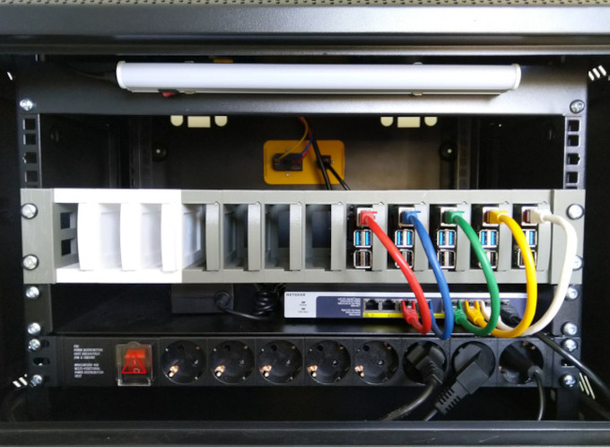

> [!WARNING]
> Cette série est restée incomplète et je n'ai pour l'instant pas prévu de la poursuivre. Malgré tout, le contenu publié peut être utile.

Ceci est la quatrième partie d'une série d'articles dans laquelle j'explique comment j'ai monté un cluster Kubernetes en utilisant des Raspberry Pi. Ici, j’expliquerai le mécanisme que j’utilise pour mesurer la consommation électrique du cluster.

| Partie                                                                  | Titre                            |
|-------------------------------------------------------------------------|----------------------------------|
| [P01]()   | Matériel                         |
| [P02]()  | Système d’exploitation et Docker |
| [P03]() | Cluster K3S                      |
| **P04**                                                                 | **Consommation électrique**      |

## Introduction

Dans un billet précédent de cette série, j’avais déjà mentionné le premier dilemme auquel je me suis confronté : [cloud vs. on premise](/#introducción). À ce moment-là, j’avais pris en compte les coûts des deux alternatives, bien que la comparaison ait été assez approximative, car pour l’option *on premise* je n’avais pas pris en compte le coût électrique du maintien du cluster en marche. C’est pourquoi j’ai depuis cherché un moyen de mesurer la consommation du cluster.

J’étais parfaitement conscient dès le départ que le projet de cluster me prendrait plusieurs mois, ne serait-ce qu’en considérant la phase de recherche, d’essais et d’apprentissage. S’il évolue comme je l’espère, le cluster deviendra un élément central et sera utilisé en continu. Mon intention est de l’utiliser pour héberger certaines applications que j’utilise habituellement et que j’ai actuellement dispersées sur plusieurs Raspberry Pi dans la maison, comme Home Assistant, que je mentionne dans ce billet.

Étant donné que le cluster sera en fonctionnement permanent, je considère qu’il est très intéressant de mesurer sa consommation électrique et d’en calculer le coût. Cela permettrait une comparaison plus précise entre le coût d’un cluster dans le cloud et celui de ce cluster local.

## Comment mesurer la consommation électrique ?

Pour mesurer la consommation du cluster, j’ai opté pour un [Sonoff Pow R2](https://www.amazon.es/gp/product/B07C864DSZ/ref=ppx_yo_dt_b_asin_title_o05_s01). Je l’ai placé *avant* la multiprise qui alimente tous les éléments du cluster. Ainsi, tout le courant nécessaire au fonctionnement du cluster — éclairage, ventilation, Raspberry, switch… — passe par le Sonoff et peut être mesuré globalement.


Pour fixer le Sonoff au boîtier du cluster, j’ai conçu [plusieurs pièces](#piezas-para-la-caja-del-cluster) que j’ai imprimées avec mon imprimante 3D. J’ai décidé de laisser le Sonoff à l’extérieur au début pour assurer une meilleure couverture WiFi.

> Le boîtier du cluster agirait-il comme une [cage de Faraday](https://en.wikipedia.org/wiki/Faraday_cage) ?

J’ai préféré être prudent et le laisser d’abord à l’extérieur, même si ce n’est pas le plus esthétique. Plus tard, je redessinerai peut-être les pièces pour l’intégrer à l’intérieur du boîtier.

Mesurer la consommation ne sert à rien si l’on n’enregistre pas les données. Pour cela, j’ai profité d’une instance de [Home Assistant](https://www.home-assistant.io) que j’utilise pour la domotique de la maison. De cette façon, je peux facilement disposer d’un tableau de bord pour visualiser la consommation. Dans ce billet je n’expliquerai pas comment installer Home Assistant, mais je décrirai certaines configurations que j’ai dû modifier.

## Sonoff Pow R2

Il s’agit d’un dispositif économique que l’on peut définir comme un interrupteur “intelligent” contrôlable en WiFi et capable de mesurer la consommation électrique. Dans mon cas, je ne l’utilise pas comme interrupteur mais uniquement comme compteur. Pour “désactiver” la fonction d’interrupteur (via logiciel), il suffit de le configurer pour qu’il soit toujours *allumé*. Une méthode plus invasive consisterait à dessouder le relais et à le court-circuiter.

Sonoff propose une application mobile pour contrôler les appareils, les programmer et visualiser leurs données. Pour cela, les informations générées par les appareils transitent par les serveurs de l’entreprise avant d’atteindre le mobile.

Cependant, je n’ai aucune envie que mes données passent par un serveur tiers, et je ne souhaite pas non plus utiliser une application mobile supplémentaire, car je veux l’intégrer à Home Assistant. Home Assistant permet d’intégrer des dispositifs de marques différentes, de centraliser toute la domotique et d’utiliser une seule application pour tout contrôler. Dans ce cas, l’avantage supplémentaire est que les données restent à la maison.

## Comment intégrer Sonoff à Home Assistant ?

[ESPHome](https://esphome.io) est la réponse !

*ESPHome* permet de contrôler à distance des dispositifs *ESP8266* et *ESP32*. Et justement, les appareils Sonoff utilisent une puce ESP8266. Ce n’est pas un hasard : j’avais vérifié cela avant d’acheter le Sonoff Pow R2. En découvrant ESPHome et sa facilité d’intégration à Home Assistant, la décision a été immédiate.

L’intégration d’ESPHome dans Home Assistant est très simple : il suffit d’[installer un add-on](https://esphome.io/guides/getting_started_hassio.html). L’installation est facile, mais j’ai rencontré des problèmes d’accès à l’interface via NGINX dus à l’utilisation de WebSockets par l’add-on. Pour les résoudre, j’ai ajouté la [configuration suivante dans NGINX](#configuración-nginx-para-websockets-de-esphome).

## Programmation du Sonoff

Pour pouvoir contrôler un dispositif basé sur l’ESP8266 avec ESPHome, il faut flasher sur la puce un firmware généré par ESPHome. Pour cela, j’ai utilisé [esphome-flasher](https://github.com/esphome/esphome-flasher/releases). Un *adaptateur USB-TTL* est indispensable pour connecter le dispositif à un PC. J’ai utilisé un [adaptateur CH340G](https://www.amazon.es/gp/product/B07HM7RPB7/ref=ppx_yo_dt_b_asin_title_o05_s01). Les pilotes se trouvent [ici](#drivers-adaptador-usb-a-ttl).

### Comment générer le firmware ?

Grâce à ESPHome, la tâche est très simple. Il suffit de rédiger un fichier YAML contenant la configuration et le comportement souhaités. ESPHome se charge ensuite de générer automatiquement le firmware correspondant.

Voici le fichier YAML que j’ai utilisé :

```yaml
esphome:
  name: rpicluster_power
  platform: ESP8266
  board: esp01_1m

# WiFi connection
wifi:
  ssid: !secret wifi_ssid
  password: !secret wifi_password

  # Enable fallback hotspot (captive portal) in case wifi connection fails
  ap:
    ssid: "Rpicluster Sonoff POW R2"
    password: "rpiclustersonoffpowr2"

# Enable logging
logger:
  baud_rate: 0

# Enable Home Assistant API
api:

# Enable over-the-air updates
ota:

# Enable Web server
web_server:
  port: 80

uart:
  rx_pin: RX
  baud_rate: 4800

sensor:
  - platform: wifi_signal
    name: "RPI Cluster WiFi Signal"
    update_interval: 15s
    icon: mdi:wifi
  - platform: uptime
    name: "RPI Cluster Uptime"
  # Power sensor
  - platform: cse7766
    update_interval: 5s
    # Current sensor
    current:
      name: "RPI Cluster Current"
      icon: mdi:current-ac
      unit_of_measurement: A
      accuracy_decimals: 3
    # Voltage sensor
    voltage:
      name: "RPI Cluster Voltage"
      icon: mdi:flash
      unit_of_measurement: V
      accuracy_decimals: 1
    # Power sensor
    power:
      name: "RPI Cluster Power"
      icon: mdi:gauge
      unit_of_measurement: W
      accuracy_decimals: 0
      id: rpiclusterpower

  - platform: total_daily_energy
    name: "RPI Cluster Daily Energy"
    power_id: rpiclusterpower
    filters:
      - multiply: 0.001
    unit_of_measurement: kWh
    icon: mdi:chart-bar

time:
  - platform: homeassistant
    id: homeassistant_time

interval:
  - interval: 10s
    then:
      if:
        condition:
          wifi.connected:
        then:
          - light.turn_on: led
        else:
          - light.turn_off: led

binary_sensor:
  # Binary sensor for the button press
  - platform: gpio
    name: "RPI Cluster Power Button"
    pin:
      number: GPIO0
      mode: INPUT_PULLUP
      inverted: true
    on_press:
      - switch.toggle: relay
  
  - platform: status
    name: "RPI Cluster Status"

switch:
  - platform: gpio
    name: "RPI Cluster Sonoff Relay"
    id: relay
    pin: GPIO12
    restore_mode: RESTORE_DEFAULT_ON

  - platform: restart
    name: "RPI Cluster Sonoff Restart"

output:
  - platform: esp8266_pwm
    id: pow_blue_led
    pin:
      number: GPIO13
      inverted: True

light:
  - platform: monochromatic
    name: "RPI Cluster POW Blue LED"
    output: pow_blue_led
    id: led

text_sensor:
  - platform: version
    name: "RPI Cluster POW Version"
```

Les informations sur les broches du Sonoff sont disponibles dans la [documentation](https://esphome.io/devices/sonoff.html#sonoff-pow-r2).

À noter : le Sonoff ne doit être connecté au PC que pour le premier flashage. Dans le YAML ci-dessus, la fonction `OTA` (over-the-air) est activée, ce qui permet de mettre à jour le firmware via le WiFi sans rouvrir l’appareil.

## Tableau de bord

Grâce à l’intégration ESPHome dans Home Assistant, il est très facile de créer un tableau de bord comme celui-ci :


Ce tableau de bord affiche :

- Consommation actuelle :
    - Courant
    - Puissance
    - Tension
- État :
    - Temps de fonctionnement ([voir template en annexe](#template-para-el-tiempo-encencido))
    - Version d’ESPHome sur le Sonoff
- Historique de consommation
- Consommation quotidienne
- État et contrôle de la LED bleue
    - Cette LED indique l’état de la connexion WiFi (allumée = connecté)
- État et contrôle du relais

> Le pic de consommation dépassant 1500W ne correspond pas à une utilisation normale du cluster. Il est dû à des tests que j’ai effectués pour calibrer le Sonoff. La calibration sera expliquée dans un autre billet.

## Conclusion

L’objectif principal de ce cluster était pédagogique. À ce jour, je ne sais pas encore si ce sera sa seule utilité ou si je l’utiliserai pour d’autres projets — les idées ne manquent pas. Connaître la consommation électrique et son coût économique est une variable importante qui influencera son utilisation à moyen et long terme.

## Annexe

### Configuration NGINX pour les WebSockets ESPHome

```
location /api/hassio_ingress {
    resolver 127.0.0.11 valid=30s;
    # Home Assistant IP
    set $upstream_app 192.168.86.4;
    # Home Assistant Internal Port
    set $upstream_port 8123;
    # Home Assistant Internal Protocol
    set $upstream_proto http;
    proxy_pass $upstream_proto://$upstream_app:$upstream_port;

    # Home Assistant External Host:Port
    proxy_set_header Host $host:9443;

    proxy_http_version 1.1;
    proxy_set_header Upgrade $http_upgrade;
    proxy_set_header Connection "upgrade";
}
```

### Pilotes pour adaptateurs USB-TTL

- [CH340G](resources/ttl_drivers/CH340G.rar)
- [CP210X](resources/ttl_drivers/CP210x_Universal_Windows_Driver.zip)
- [PL2303](resources/ttl_drivers/PL2303_Prolific_DriverInstaller_v1_8_0.zip)

### Template pour le temps de fonctionnement

Par défaut, le Sonoff envoie le temps d’allumage en secondes. Comme ce dispositif est conçu pour rester en marche en continu et envoyer des mesures, cela n’a pas beaucoup de sens d’afficher le nombre brut de secondes. Pour obtenir une information plus utile, j’ai créé le template suivant :

```yaml
sensor:
  - platform: template
    sensors:
      rpi_cluster_pow_uptime_readable:
        friendly_name: "RPI Cluster Uptime"
        icon_template: "mdi:timer"
        value_template: >-
          
          
          
            {{ days }} days, {{ (uptime - (days * 86400)) | int | timestamp_custom('%H:%M:%S', false) }}
          
            {{ uptime | int | timestamp_custom('%H:%M:%S', false) }}
          
```

S’il est allumé depuis plus d’un jour, il affichera le nombre de jours ainsi que les heures, minutes et secondes. Sinon, seules les heures, minutes et secondes seront affichées.

> Ce template pourrait être encore amélioré pour intégrer mois et années.

### Pièces pour le boîtier du cluster

Pour concevoir toutes les pièces, j’ai utilisé [OnShape](https://www.onshape.com). Tous mes designs pour le boîtier du cluster sont publics et disponibles [ici](https://cad.onshape.com/documents?nodeId=4157ec7e4f12d21ec2893ac1&resourceType=folder).

Comme on peut le voir sur les images suivantes, les pièces pour le Sonoff ne sont pas les seules que j’ai conçues. J’ai également créé un cache pour l’une des ouvertures arrière, ainsi qu’un autre pour accueillir à la fois la [prise électrique](https://www.amazon.es/gp/product/B07RRY5MYZ/ref=ppx_yo_dt_b_asin_title_o06_s00) et la [prise réseau](https://www.amazon.es/gp/product/B01MD2AYSW/ref=ppx_yo_dt_b_asin_title_o04_s00) du cluster :


Je suis très satisfait du résultat final : tout est proprement organisé et le câblage est minimal :




---------------

---
title: Monto un cluster Kubernetes con Raspberry Pi (parte IV)
summary: Cuarta parte de una serie donde explico cómo he montado un cluster de Kubernetes utilizando Raspberry Pi. En esta entrega explicaré el mecanismo que utilizo para medir el consumo eléctrico del cluster.
date: 2020-10-22
lastmod: 2025-12-04
tags:
  - cluster
  - raspberry
  - home assistant
  - esphome
  - sonoff
---

> [!WARNING]
> Esta serie quedó incompleta y por ahora no tengo previsto continuarla. Aun así, el contenido publicado puede ser útil.

Esta es la cuarta parte de una serie de posts en la que explico cómo he montado un cluster de Kubernetes utilizando Raspberry Pi. Aquí explicaré el mecanismo que utilizo para medir el consumo eléctrico del cluster.

| Parte                                                                   | Título                     |
|-------------------------------------------------------------------------|----------------------------|
| [P01]()   | Hardware                   |
| [P02]()  | Sistema Operativo y Docker |
| [P03]() | Cluster K3S                |
| **P04**                                                                 | **Consumo eléctrico**      |

## Introducción

En un post anterior de esta serie ya mencioné la primera disyuntiva a la que me enfrenté: [cloud vs. on premise](/#introducción). En ese momento tuve en cuenta los costes de ambas alternativas, aunque la comparativa fue poco precisa, ya que para la opción *on premise* no tuve en cuenta el coste eléctrico para mantener el cluster encendido. Es por esto que desde entonces he buscado la manera de medir el gasto eléctrico del cluster.

Desde un principio era totalmente consciente de que el proyecto del cluster me iba a llevar varios meses, y eso teniendo únicamente en cuenta únicamente el tiempo de investigación, prueba y aprendizaje. Si evoluciona como espero, el cluster se convertirá en una pieza central y tendrá un uso continuado. Mi intención es utilizarlo para ejecutar en él algunas aplicaciones que uso habitualmente y que tengo desperdigadas en varias raspberry por la casa, como por ejemplo el Home Assistant que se menciona en este post.

Teniendo en cuenta que el cluster va a estar en funcionamiento ininterrumpidamente, considero que sería muy interesante medir el consumo eléctrico y calcular su coste. De esta forma podría hacer una comparativa más precisa entre el coste de un cluster en el cloud y el coste de este cluster.

## ¿Cómo medir el consumo eléctrico?

Para medir el consumo del cluster me he decantado por un [Sonoff Pow R2](https://www.amazon.es/gp/product/B07C864DSZ/ref=ppx_yo_dt_b_asin_title_o05_s01). Lo he colocado "antes" de la regleta que alimenta todos los elementos del cluster. De esta forma toda la corriente necesaria para hacer funcionar el cluster: luces, ventilación, raspberry, switch... pasará a través del Sonoff y podrá ser contabilizada de forma global.


Para acoplar el Sonoff a la caja del cluster he diseñado [unas piezas](#piezas-para-la-caja-del-cluster) y las he imprimido con mi impresora 3D. He decidido inicialmente dejar el Sonoff en el exterior para tener una mejor cobertura WiFi.

> ¿La caja del cluster actuaría como una [caja Faraday](https://en.wikipedia.org/wiki/Faraday_cage)?

En este caso he preferido ser pruedente y dejarlo incialmente por fuera, aunque no sea lo más estético. En un futuro quizás me anime a rediseñar las piezas para dejar el Sonoff en el interior de la caja del cluster.

De nada sirve medir el consumo si no se realiza un registro del mismo. Para realizar el registro del consumo eléctrico contabilizado por el Sonoff he aprovechado una instancia de [Home Assistant](https://www.home-assistant.io) que tengo para la domótica de mi casa. De esta forma puedo disponer fácilmente de un panel para visualizar dicho consumo. En este post no voy a explicar cómo instalar Home Assistant, aunque sí que voy a describir algunas de las configuraciones que he tenido que cambiar.

## Sonoff Pow R2

Este es un dispositivo barato que podría definirse como un interruptor "inteligente" que puede controlarse via WiFi y que permite medir el consumo eléctrico. En este caso no lo utilizo como interruptor, sino únicamente lo uso para medir el consumo. La forma de "anular" el interruptor (con software) es configurarlo de tal forma que esté siempre "encendido". Otra forma más invasiva de conserguirlo sería desoldar el relay y puentearlo.

Sonoff proporciona una aplicación móvil a través de la cual se pueden controlar los diferentes dispositivos de la marca, programarlos y visualizar la información que generan. Para que todo esto sea posible, la información generada por los dispositivos viaja hasta los servidores de la empresa y desde ahí a los dispositivos móviles.

Sin embargo, ni me interesa que mis datos pasen por un servidor de un tercero, ni tengo interés en usar una aplicación móvil adicional, porque lo que quiero es integrarlo con Home Assistant. La ventaja de Home Assistant es que me permite integrar dispositivos de distintos fabricantes, tener toda la domótica centralizada y utilizar una única aplicación para controlar todo. En este caso, tiene la ventaja añadida de que los datos no pasan por ningún servidor ajeno, se quedan en casa.

## ¿Cómo integrar Sonoff con Home Assistant?

[ESPHome](https://esphome.io) es la respuesta!

*ESPHome* es un sistema que permite controlar de forma remota dispositivos *ESP8266* y *ESP32*. Y casualmente los dispositivos Sonoff llevan un chip ESP8266. Realmente no es casualidad, esto es algo que investigué antes de decidirme a comprar el Sonoff Pow R2. Al descubrir ESPHome y lo fácil que era integrarlo con Home Assistant, la decisión estaba clara.

La integración de ESPHome con Home Assistant es muy sencilla y consiste en [instalar un add-on en Home Assistant](https://esphome.io/guides/getting_started_hassio.html). La instalación del add-on es muy sencilla pero he tenido problemas de acceso a la interfaz a través de NGINX, debidos al uso de WebSockets que hace el add-on de ESPHome. Para solucionarlo he incluído la [siguiente configuración en NGINX](#configuración-nginx-para-websockets-de-esphome).

## Programación del Sonoff

Para poder controlar un dispositivo con el chip ESP8266 mediante ESPHome hay que flashear en el chip un binario con el código de ESPHome. Para flashear dicho binario he utilizado [esphome-flasher](https://github.com/esphome/esphome-flasher/releases). En imprescindible un *adaptador serie USB a TTL* para poder conectar el dispositivo a un PC y flashear el código. Yo he utilizado un [adaptador CH340G](https://www.amazon.es/gp/product/B07HM7RPB7/ref=ppx_yo_dt_b_asin_title_o05_s01). Los drivers de los adaptadores se encuentran accesibles [aquí](#drivers-adaptador-usb-a-ttl).

### ¿Cómo obtenemos el binario con el código a flashear?

Esto es una tarea muy sencilla, gracias a ESPHome que lo simplifica al máximo. Simplemente hay que generar un fichero yaml con la configuración y comportamiento que queramos que tenga el dispositivo. ESPHome se encarga de generar un binario con el código correspondiente al contenido de dicho fichero yaml.

Este es el fichero yaml que he utilizado en este caso:

```yaml
esphome:
  name: rpicluster_power
  platform: ESP8266
  board: esp01_1m

# WiFi connection
wifi:
  ssid: !secret wifi_ssid
  password: !secret wifi_password

  # Enable fallback hotspot (captive portal) in case wifi connection fails
  ap:
    ssid: "Rpicluster Sonoff POW R2"
    password: "rpiclustersonoffpowr2"

# Enable logging
logger:
  baud_rate: 0

# Enable Home Assistant API
api:

# Enable over-the-air updates
ota:

# Enable Web server
web_server:
  port: 80

uart:
  rx_pin: RX
  baud_rate: 4800

sensor:
  - platform: wifi_signal
    name: "RPI Cluster WiFi Signal"
    update_interval: 15s
    icon: mdi:wifi
  - platform: uptime
    name: "RPI Cluster Uptime"
  # Power sensor
  - platform: cse7766
    update_interval: 5s
    # Current sensor
    current:
      name: "RPI Cluster Current"
      icon: mdi:current-ac
      unit_of_measurement: A
      accuracy_decimals: 3
    # Voltage sensor
    voltage:
      name: "RPI Cluster Voltage"
      icon: mdi:flash
      unit_of_measurement: V
      accuracy_decimals: 1
    # Power sensor
    power:
      name: "RPI Cluster Power"
      icon: mdi:gauge
      unit_of_measurement: W
      accuracy_decimals: 0
      id: rpiclusterpower

  - platform: total_daily_energy
    name: "RPI Cluster Daily Energy"
    power_id: rpiclusterpower
    filters:
      - multiply: 0.001
    unit_of_measurement: kWh
    icon: mdi:chart-bar

time:
  - platform: homeassistant
    id: homeassistant_time

interval:
  - interval: 10s
    then:
      if:
        condition:
          wifi.connected:
        then:
          - light.turn_on: led
        else:
          - light.turn_off: led

binary_sensor:
  # Binary sensor for the button press
  - platform: gpio
    name: "RPI Cluster Power Button"
    pin:
      number: GPIO0
      mode: INPUT_PULLUP
      inverted: true
    on_press:
      - switch.toggle: relay
  
  - platform: status
    name: "RPI Cluster Status"

switch:
  - platform: gpio
    name: "RPI Cluster Sonoff Relay"
    id: relay
    pin: GPIO12
    restore_mode: RESTORE_DEFAULT_ON

  - platform: restart
    name: "RPI Cluster Sonoff Restart"

output:
  - platform: esp8266_pwm
    id: pow_blue_led
    pin:
      number: GPIO13
      inverted: True

light:
  - platform: monochromatic
    name: "RPI Cluster POW Blue LED"
    output: pow_blue_led
    id: led

text_sensor:
  - platform: version
    name: "RPI Cluster POW Version"
```

La información de los pines de entrada/salida del sonoff se encuentra en la [documentación](https://esphome.io/devices/sonoff.html#sonoff-pow-r2).

Quiero destacar que el sonoff únicamente hay que conectarlo al pc para flashearlo la primera vez. En el yaml anterior se habilita `OTA` (over-the-air), lo que permite actualizar el código a través de la conexión WiFi, sin necesidad de volver a abrir el dispositivo y desmontarlo de donde estuviera.

## Panel de control

Gracias a la integración de ESPHome con Home Assistant es muy sencillo crear un panel de control como el que se ve en la siguiente imagen:


En el panel anterior se dispone de:

- Consumo actual
  - Corriente
  - Potencia
  - Voltaje
- Estado
  - Tiempo en marcha ([ver template en anexo](#template-para-el-tiempo-encencido) )
  - Versión de ESPHome en el sonoff
- Histórico de consumo
- Consumo diario
- Estado y control del led azul
  - Este led lo utilizo para representar la conectividad a la WiFi (encendido significa conectado)
- Estado y control del relay

> El pico de consumo de más de 1500W no se corresponde a un uso normal del cluster. Se corresonde a unas pruebas de estuve realizando para calibrar el Sonoff. La calibración del Sonoff queda fuera del ámbito de este post y lo explicaré en otro momento.

## Conclusión

El principal objetivo de construir este cluster era didáctico. A día de hoy no tengo claro si esta va a ser su única finalidad o si, una vez terminado, lo voy a utilizar con otros fines, puesto que ideas no me faltan. Conocer el consumo eléctrico y su consiguiente coste económico es una variable que voy a tener muy en cuenta a la hora de decidir el uso del cluster a medio-largo plazo.

## Anexo

### Configuración NGINX para WebSockets de ESPHome

```
location /api/hassio_ingress {
    resolver 127.0.0.11 valid=30s;
    # Home Assistant IP
    set $upstream_app 192.168.86.4;
    # Home Assistant Internal Port
    set $upstream_port 8123;
    # Home Assistant Internal Protocol
    set $upstream_proto http;
    proxy_pass $upstream_proto://$upstream_app:$upstream_port;

    # Home Assistant External Host:Port
    proxy_set_header Host $host:9443;

    proxy_http_version 1.1;
    proxy_set_header Upgrade $http_upgrade;
    proxy_set_header Connection "upgrade";
}
```

### Drivers adaptador USB a TTL

- [CH340G](resources/ttl_drivers/CH340G.rar)
- [CP210X](resources/ttl_drivers/CP210x_Universal_Windows_Driver.zip)
- [PL2303](resources/ttl_drivers/PL2303_Prolific_DriverInstaller_v1_8_0.zip)

### Template para el tiempo en marcha

Por defecto el tiempo que lleva encendido el sonoff se envía en segundos. Este dispositivo está pensado para estar contínuamente encendido enviando las lecturas, independientemente de si el cluster está en marcha o no. Por este motivo no tiene mucho sentido visualizar en el panel esta información en crudo. Para transformar este dato en otro que aporte más valor he creado el siguiente template en el Home Assistant:

```yaml
sensor:
  - platform: template
    sensors:
      rpi_cluster_pow_uptime_readable:
        friendly_name: "RPI Cluster Uptime"
        icon_template: "mdi:timer"
        value_template: >-
          
          
          
            {{ days }} days, {{ (uptime - (days * 86400)) | int | timestamp_custom('%H:%M:%S', false) }}
          
            {{ uptime | int | timestamp_custom('%H:%M:%S', false) }}
          
```

Si lleva más de un día encendido, se visualizará el número de días que lleva encendido junto con las horas, minutos y segundos. Si lleva menos de un día, simplemente se visualizarán las horas, minutos y segundos.

> Este template podría mejorarse aún más teniendo en cuenta meses y años

### Piezas para la caja del cluster

Para realizar el diseño de todas las piezas he utilizado [OnShape](https://www.onshape.com). Todos los diseños que he realizado para la caja son públicos y encuentran disponibles [aquí](https://cad.onshape.com/documents?nodeId=4157ec7e4f12d21ec2893ac1&resourceType=folder).

Como se puede ver en las siguientes imágenes, las piezas para albergar el Sonoff no son las únicas que he diseñado para la caja del cluster. También he diseñado una tapa para una de las aberturas traseras y otra tapa para albergar tanto la [toma de corriente](https://www.amazon.es/gp/product/B07RRY5MYZ/ref=ppx_yo_dt_b_asin_title_o06_s00) como la [toma de red](https://www.amazon.es/gp/product/B01MD2AYSW/ref=ppx_yo_dt_b_asin_title_o04_s00) de todo el cluster:


Estoy muy contento con el resultado final, la verdad que ha quedado todo muy organizado y con un mínimo de cables:

